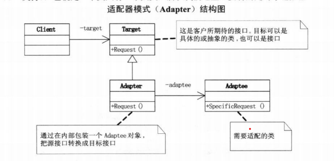

## 1. 简单工厂模式
计算器的实现
operator工厂类
```cpp
class OperatorFactory
{
public:
    static Operator* createOperator(string operator){
        switch(operator){
            case "+": 
                Operator *oper = new OperatorAdd();
                break;
            //...
        }
    }
}

class Operator
{
private:
    double numA;
    double numB;
public:
    virtual double getResult();
}
```
operator运算类继承自operator工厂类,重写其的getresult方法
```cpp
class OperatorAdd : public OperatorFactory
{   
public:
    virtual double getResult(){
        double result = numA + numb;
    }
}
class OperatorMul : public OperatorFactory
{   
public:
    virtual double getResult(){
        double result = numA * numb;
    }
}
// ...
```
在使用过程中,通过传入参数使其产生相应的operator运算类,再调用getresult方法
```cpp
Operator oper = OperatorFactory.createOperator("+");
oper.numA = 1;
oper.numB = 2;
double result = oper.getResult();

```

其属于类创建型模式，它会根据参数不同返回继承自同一基类的不同子类
模式结构：
Factory：工厂角色 负责实现创建所有实例的内部逻辑
Product：抽象产品角色 所创建的所有对象的父类，负责描述所有实例所共有的公共接口
ConcreteProduct：具体产品角色 创建目标，所有创建的对象都充当这个角色的某个具体类的实例。


模式分析：
优点：
1. 对象创建和对象业务处理分离，降低耦合度
2. 客户端无须知道所创建的具体产品类的类名，只需要知道具体产品类所对应的参数
3. 通过引入配置文件，可以在不修改任何客户端代码的情况下更换和增加新的具体产品类，在一定程度上提高了系统的灵活性
缺点：
1. 工厂崩坏，整个系统都受影响
2. 使用简单工厂模式将会增加系统中类的个数，在一定程序上增加了系统的复杂度和理解难度
3. 违反开闭原则，添加新产品需要修改工厂逻辑
4. 工厂无法继承，不利于系统的扩展和维护

## 2. 策略模式
完成一项任务，往往可以有多种不同的方式，每一种方式称为一个策略，我们可以根据环境或者条件的不同选择不同的策略来完成该项任务。
定义一些独立的类来封装不同的算法，每一个类封装一个具体的算法，每一个封装算法的类我们都可以称之为策略，为了保证这些策略的一致性，一般会用一个抽象的策略类来做算法的定义，而具体每种算法则对应于一个具体策略类。

```cpp
// 上下文环境
class Context 
{
public:
	Context();
	virtual ~Context();
	void algorithm();
	void setStrategy(Strategy* st);
private:
	Strategy *m_strategy;
};

// 策略
class ConcreteStrategyA : public Strategy
{
public:
	ConcreteStrategyA();
	virtual ~ConcreteStrategyA();
	virtual void algorithm();
};

// 如何使用
int main(int argc, char *argv[])
{
	Strategy * s1 = new ConcreteStrategyA();
	Context * cxt = new Context();
	cxt->setStrategy(s1);
	cxt->algorithm();

	Strategy *s2 = new ConcreteStrategyB();
	cxt->setStrategy(s2);
	cxt->algorithm();
}
```


策略模式是一种对象行为型模式
模式结构：
Context: 环境类
Strategy: 抽象策略类 统一算法接口
ConcreteStrategy: 具体策略类 具体算法


模式分析：
优点：
1. 策略模式提供了对“开闭原则”的完美支持，用户可以在不修改原有系统的基础上选择算法或行为，也可以灵活地增加新的算法或行为
2. 策略模式提供了管理相关算法族 可以替换继承关系的办法。
3. 简化了单元测试，可以对每个接口单独测试。
4. 使用策略模式可以避免使用多重条件转移语句。
缺点：
1. 用户需要知道所有的策略类
2. 将会产生很多策略类

## 3. 简单工厂模式和策略模式的区别
可以发现，两种模式的UML类图是十分类似的，但是他们的侧重点不同
对于简单工厂模式来说，其主要关注结果类对象的产生，用户所接触到的只有工厂类和参数，而不需要关注产品类如何产生和实现，注重结果
对于策略模式来说，其侧重于过程，用户需要了解所有的策略类，在使用过程中可以随意切换策略而不影响正常处理，其更关注策略类对象的过程变换

## 4. 设计模式原则
单一职责原则：对一个类而言，应该仅有一个引起它变化的原因
开放封闭原则：软件实体（类、模块、函数等）可以扩展、但不可修改
依赖倒转原则：
    高层模块不应依赖低层模块，两者应依赖于抽象
    抽象不应依赖于细节，细节应依赖抽象
里氏代换原则：子类必须能够替换掉它的父类
迪米特法则：如果两个类不必彼此直接通信，那么这两个类就不应当发生直接的相互作用。如果其中一个类需要调用另一个类的某一个方法，可以通过第三者转发
合成/聚合复用原则：尽量使用合成/聚合，尽量不使用类继承

## 5. 装饰模式
在给一个类或对象追加对象行为时，通常有以下形式：
继承机制，通过继承一个现有类使子类在拥有自身方法的同时还拥有父类的方法。但是这种方法是静态的，用户不能控制增加行为的方式和时机（不能即时动态增加）。
关联机制，将类对象嵌入另一个对象中，由另一个对象来决定是否调用嵌入对象的行为以便扩展自己的行为，我们称这个嵌入的对象为装饰器(Decorator)

```cpp
class Component{
public:
    virtual void Operation() = 0;
}

class Decorator : public Component{
protected:
    Component component;
public:
    // 设置component
    void SetComponent (Component component){
        this.component = component;
    }
public:
    void Operation ()override{
        if (component != null){
            component.Operation();
        }
    }
}

class ConcreteDecoratorA : public Decorator{
private:
    void addedBehavior();
public:
    void Operation () override {
        base.Operation();
        addedBehavior();
    };
}
// ... ConcreteDecoratorB

// 使用
int main(){
    ConcreteComponent c = new ConcreteComponent();
    ConcreteDecoratorA d1 = new ConcreteDecoratorA();
    ConcreteDecoratorB d2 = new ConcreteDecoratorB();

    d1.SetComponent(c);
    d2.SetComponent(d1);
    d2.Operation();
}
```

装饰模式是一种结构型模式，用以动态地给一个对象增加一些额外的职责，用户不需要知道装饰前后有什么不同，在使用时不应增加更多的子类而使对象功能拓展

模式结构：
Component: 抽象构件
ConcreteComponent: 具体构件
Decorator: 抽象装饰类
ConcreteDecorator: 具体装饰类


Component是所有组件的抽象基类，这里的类都继承自它，通常都有一个内置的Component *m_component;
ConcreteComponent即具体的实现，Component是抽象接口，而ConcreteComponent可以说是Component的一个具体实现类，这个类才能创建对象，其通过重写Component类内的纯虚函数operation()，即代表具有operation操作的对象类
Decorator是各种具体装饰类的抽象，内部有一个Component指针，并有Operation和setComponent接口
ConcreteDecorator是具体的装饰类，其可以通过setComponent使某一组件内嵌于该装饰下，而Operation会先调用base.operation,再调用自身附加的内容，借此来做到装饰的效果

模式分析：
优点：
1. 装饰模式比继承机制扩展功能更灵活
2. 可以通过一种动态的方式来扩展一个对象的功能，通过配置文件可以在运行时选择不同的装饰器，从而实现不同的行为
3. 不同的具体装饰类以及这些装饰类的排列组合，可以随意组合得到功能更为强大的对象
4. 构建和装饰独立变化，互不干扰，他们之间修改维护互不影响，符合开闭原则
缺点：
1. 使用装饰模式进行系统设计时将产生很多小对象，这些对象的区别在于它们之间相互连接的方式有所不同，而不是它们的类或者属性值有所不同，同时还将产生很多具体装饰类。这些装饰类和小对象的产生将增加系统的复杂度，加大学习与理解的难度。
2. 这种比继承更加灵活机动的特性，也同时意味着装饰模式比继承更加易于出错，排错也很困难，对于多次装饰的对象，调试时寻找错误可能需要逐级排查，较为烦琐。

## 6. 代理模式
通过引入第三方作为媒介进行对外访问和操作的模式，代理对象在受代理对象和目标对象之间起到中介的作用

```cpp
class Proxy : public Subject{
public:
	Proxy();
	virtual ~Proxy();
	void request();
private:
	void afterRequest();
	void preRequest();	
	RealSubject *m_pRealSubject;
};

// 使用
int main(int argc, char *argv[]){
	Proxy proxy;
	proxy.request();
	return 0;
}
```

代理模式是结构式模式
模式结构：
Subject: 抽象主题角色 定义受代理角色和代理角色的公共接口，即所要委托第三方完成的事物的接口
Proxy: 代理主题角色
RealSubject: 真实主题角色


模式分析：
优点：
1. 代理模式能够协调调用者和被调用者，一定程度上降低了系统的耦合度
2. 远程代理使得客户端可以访问在远程机器上的对象，远程机器可能具有更好的计算性能与处理速度，可以快速响应并处理客户端请求。
3. 虚拟代理通过使用一个小对象来代表一个大对象，可以减少系统资源的消耗，对系统进行优化并提高运行速度。
4. 保护代理可以控制对真实对象的使用权限。
缺点：
1. 有些类型的代理模式可能会造成请求的处理速度变慢。
2. 实现代理模式需要额外的工作，有些代理模式的实现非常复杂。

## 7. 工厂方法模式
在简单工厂模式中，以计算器为例，若要在原有的基础上增加一个运算类，就需要在工厂类中增加一个switch的case情况，这违反了开放封闭原则
工厂方法模式则是通过提供工厂抽象接口，把工厂的实例化延迟到子类实现，在扩展时只用增加相应的工厂和运算类而不需要修改工厂类

工厂方法模式是创建型模式
模式结构：
Product：抽象产品
ConcreteProduct：具体产品
Factory：抽象工厂
ConcreteFactory：具体工厂


```cpp
// 使用
IFactory operFactory = new AddFactory();
Operation oper = operFactory.CreateOperation();
oper.NumberA = 1;
oper.NumberB = 2;
double result=oper.GetResult();
```

模式分析：
优点：
1. 简单工厂模式的推广和抽象
2. 工厂类的多态性，使工厂可以自主确定创建何种产品对象，而如何创建这个对象的细节则完全封装在具体工厂内部，也称为多态工厂模式
3. 系统加入产品时只需增加具体工厂和具体产品类，系统的可扩展性好，符合“开闭原则”。
缺点：
1. 系统中类的个数将成对增加，在一定程度上增加了系统的复杂度，有更多的类需要编译和运行，会给系统带来一些额外的开销。
2. 由于考虑到系统的可扩展性，需要引入抽象层，在客户端代码中均使用抽象层进行定义，增加了系统的抽象性和理解难度，且在实现时可能需要用到DOM、反射等技术，增加了系统的实现难度

## 8. 原型模式
原型模式就是用原型实例对象（待复制对象）中再生成另一个可定制的的对象，而无须指定对象创建细节的方法

```cpp
// 原型类
class Prototype{
private:
    string m_id;
public:
    Prototype(string id): m_id(id) {} ;

    virtual Prototype Clone() = 0;
}
// 具体原型类
class ConcretePrototype1 : public Prototype{
public:
    Prototype Clone() override{
        return (Prototype)this.wiseClone();// 浅拷贝
    }
}

int main(){
    ConcretePrototype1 p1 = new ConcretePrototype1("I");
    ConcretePrototype1 c1 = (ConcretePrototype1)p1.Clone();
}
```

原型模式是创建型模式
模式结构：
Client： 待克隆实例
Prototype： 原型类（可克隆）
ConcretePrototype： 具体原型类


模式分析：
优点：
1. 简化对象创建过程的同时提高效率
2. 屏蔽底层创建对象的细节，可以直接使用
3. 克隆的实例方法间互不干扰
缺点：
1. 浅克隆对包含循环引用的复杂对象不友好

## 9. 模板方法模式
当需要在完成某一细节层次一致的一个过程或一系列步骤，但个别步骤在更详细的层次上的实现可能不同，就需要考虑模板方法模式

定义一个操作中算法的骨架，而将某一步骤延迟到子类中，模板方法可以使子类不改变父类的算法结构而使某些实现不同

模式结构：
AbstractClass 是抽象类,其实也就是一抽象模板,定义并实现了一个模版方法。这个模版方法一般是一个具体方法,它给出了一个顶级逻辑的骨架,而逻辑的组成步骤在相应的抽象操作中,推迟到子类实现。顶级逻辑也有可能调用一些具体方法。
ConcreteClass,实现父类所定义的一个或多个抽象方法。每一个AbstractClass 都可以有任意多个ConcreteClass与之对应,而每一个ConcreteClass都可以给出这些抽象方法(也就是顶级逻辑的组成步骤)的不同实现,从而使得顶级逻辑的实现各不相同。


模式分析：
优点：
1. 不变行为迁移到超类，去除子类重复代码，代码复用率高
缺点：
1. 每个不同实现都需要一个子类，类数量骤增
2. 父类由子类实现，子类会影响父类的结果，程序可读性降低

## 10. 外观模式
外部与一个子系统的通信必须通过一个统一的外观对象进行，为子系统中的一组接口提供一个一致的界面，外观模式定义了一个高层接口，这个接口使得这一子系统更加容易使用。

模式结构：
Facade: 外观角色
SubSystem:子系统角色


模式分析：
优点：
1. 对客户屏蔽子系统组件，减少了客户处理的对象数目并使得子系统使用起来更加容易。
2. 实现了子系统与客户之间的松耦合关系，这使得子系统的组件变化不会影响到调用它的客户类，只需要调整外观类即可。
3. 降低了大型软件系统中的编译依赖性，并简化了系统在不同平台之间的移植过程，因为编译一个子系统一般不需要编译所有其他的子系统。
4. 只是提供了一个访问子系统的统一入口，并不影响用户直接使用子系统类。
缺点：
1. 不能很好地限制客户使用子系统类，如果对客户访问子系统类做太多的限制则减少了可变性和灵活性。
2. 在不引入抽象外观类的情况下，增加新的子系统可能需要修改外观类或客户端的源代码，违背了“开闭原则”。

## 11. 建造者模式
当需要将一个复杂对象的构建和它的表示分离，即使得同样的构建过程可以创建不同的表示，则可以使用建造者模式
例如：画小人需要画头身体双手双脚，但是如果需要瘦小人、胖小人、高小人等一有细微区别但是不能缺少任何一个部位的情况就可以用到建造者模式
对于小人使用
```cpp
// 建造人的抽象类
class Person{
protected:
    Graphics g;
    Pen p;
public:
    PersonBuilder(Graphics g, Pen p):g(g), p(p){}
    virtual void BuildHead() = 0;
    virtual void BuildBody() = 0;
    virtual void BuildLeftArm() = 0;
    virtual void BuildRightArm() = 0;
    virtual void BuildLeftLeg() = 0;
    virtual void BuildRightLeg() = 0;
}

// 具体的人建造类
class PersomThinBuilder : public PersonBuilder
{
    void PersomThinBuilder::BuildHead(){
        g.DrawEllipse(p, 50, 20, 30, 30);
    }
    // ...
}

// 建造指挥者
class PersonDirector{
private:    
    PersonBuilder pb;
public:
    void CreatePerson(){
        pb.BuildHead();
        pb.BuildLeftArm();
        // ...
    }
}
```

模式结构：
Builder：抽象建造者
ConcreteBuilder：具体建造者
Director：指挥者
Product：产品角色


模式分析：
优点：
1. 客户端不必知道产品内部组成的细节，将产品本身与产品的创建过程解耦，使得相同的创建过程可以创建不同的产品对象。
2. 每一个具体建造者都相对独立，而与其他的具体建造者无关，用户使用不同的具体建造者即可得到不同的产品对象
3. 可以更加精细地控制产品的创建过程 。
4. 增加新的具体建造者无须修改原有类库的代码，指挥者类针对抽象建造者类编程，系统扩展方便，符合“开闭原则”
缺点：
1. 建造者模式所创建的产品一般具有较多的共同点，其组成部分相似，如果产品之间的差异性很大，则不适合使用建造者模式，因此其使用范围受到一定的限制。
2. 产品的内部变化复杂，可能会导致需要定义很多具体建造者类来实现这种变化，导致系统变得很庞大

## 12. 观察者模式
建立一种对象与对象之间的依赖关系，一个对象发生改变时将自动通知其他对象，其他对象将相应做出反应。在此，发生改变的对象称为观察目标，而被通知的对象称为观察者，一个观察目标可以对应多个观察者，而且这些观察者之间没有相互联系，可以根据需要增加和删除观察者，使得系统更易于扩展。

模式结构：


模式分析：
优点：
1. 观察者模式可以实现表示层和数据逻辑层的分离，并定义了稳定的消息更新传递机制，抽象了更新接口，使得可以有各种各样不同的表示层作为具体观察者角色。
2. 观察者模式在观察目标和观察者之间建立一个抽象的耦合。
3. 观察者模式支持广播通信。
4. 观察者模式符合“开闭原则”的要求。
缺点：
1. 如果一个观察目标对象有很多直接和间接的观察者的话，将所有的观察者都通知到会花费很多时间。
2. 如果在观察者和观察目标之间有循环依赖的话，观察目标会触发它们之间进行循环调用，可能导致系统崩溃。
3. 观察者模式没有相应的机制让观察者知道所观察的目标对象是怎么发生变化的，而仅仅只是知道观察目标发生了变化。

## 13. 抽象工厂模式
在工厂方法模式中具体工厂负责生产具体的产品，每一个具体工厂对应一种具体产品，工厂方法也具有唯一性，一般情况下，一个具体工厂中只有一个工厂方法或者一组重载的工厂方法。有时候我们需要一个工厂可以提供多个产品对象，而不是单一的产品对象。
抽象工厂模式：提供一个创建一系列相关或相互依赖对象的接口，而无须指定它们具体的类。

创建型模式
模式结构：


模式分析：
优点：
1. 其隔离各类的实现和生成，只需要改变具体工厂的实例就可以改变整体行为，达到高内聚低耦合
2. 增加工厂和产品族方便，无需修改，符合开闭原则
缺点：
1. 添加新产品时，需要对抽象工厂及其子类大范围修改，带来不便
2. 增加工厂容易和产品族容易，但是增加新产品等级结构麻烦，导致了开闭原则的倾斜性

## 14. 状态模式
在很多情况下，一个对象的行为取决于一个或多个动态变化的属性，这样的属性叫做状态，当一个这样的对象与外部事件产生互动时，其内部状态就会改变，从而使得系统的行为也随之发生变化。如果单纯用ifelse语句来控制就可能会产生大量冗余的控制语句，在一个类中有如此多的ifelse负担会很重
状态模式(State Pattern) ：允许一个对象在其内部状态改变时改变它的行为，对象看起来似乎修改了它的类。

状态模式是一种对象行为型模式
模式结构：


```c#
abstract class State{
    public abstract void handle(Context context);
}
class ConcreteStateA : State{
public override void Handle (Context context){
        context.State = new ConcreteStateB();
    }
}

class ConcreteStateB : State{
public override void Handle (Context context){
        context.State = new ConcreteStateA();
    }
}

class Context{
    private State state;
    public Context(State state){
        this.state = state;
    }
    public void Request(){
        state.Handle(this);
    }
}
```

模式分析：
优点：
1. 封装了转换规则。
2. 将所有与某个状态有关的行为放到一个类中，并且可以方便地增加新的状态，只需要改变对象状态即可改变对象的行为。
3. 允许状态转换逻辑与状态对象合成一体，而不是某一个巨大的条件语句块。
4. 可以让多个环境对象共享一个状态对象，从而减少系统中对象的个数。
缺点：
1. 状态模式的使用必然会增加系统类和对象的个数。
2. 状态模式的结构与实现都较为复杂，如果使用不当将导致程序结构和代码的混乱。
3. 状态模式对“开闭原则”的支持并不太好，对于可以切换状态的状态模式，增加新的状态类需要修改那些负责状态转换的源代码，否则无法切换到新增状态；而且修改某个状态类的行为也需修改对应类的源代码。

## 15. 适配器模式
功能如其名所式，是将一个接口转换成客户希望的另一个接口，适配器模式使接口不兼容的那些类可以一起工作
```cpp
// 客户期望接口
class Target{
public:
    virtual void Request(){
        cout<<"普通请求"<<endl;
    }
}
// 待适配的类
class Adaptee{
public:
    void SpecificRequest(){
        cout<<"特殊请求"<<endl;
    }
}
// 适配器
class Adapter : public Target{
private:
    Adaptee adaptee = new Adaptee();
public :
    void Request() override{
        adaptee.SpecificRequest();
    }
}
```

适配器模式是结构型模式
其分为两种：
对象适配器：

类适配器：


模式分析：
优点：
1. 将目标类和适配者类解耦，通过引入一个适配器类来重用现有的适配者类，而无须修改原有代码。
2. 增加了类的透明性和复用性，将具体的实现封装在适配者类中，对于客户端类来说是透明的，而且提高了适配者的复用性。
3. 灵活性和扩展性都非常好，通过使用配置文件，可以很方便地更换适配器，也可以在不修改原有代码的基础上增加新的适配器类，完全符合“开闭原则”。
类适配器模式还具有如下优点：
由于适配器类是适配者类的子类，因此可以在适配器类中置换一些适配者的方法，使得适配器的灵活性更强。
对象适配器模式还具有如下优点：
一个对象适配器可以把多个不同的适配者适配到同一个目标，也就是说，同一个适配器可以把适配者类和它的子类都适配到目标接口。
缺点：
类适配器模式的缺点如下：
对于Java、C#等不支持多重继承的语言，一次最多只能适配一个适配者类，而且目标抽象类只能为抽象类，不能为具体类，其使用有一定的局限性，不能将一个适配者类和它的子类都适配到目标接口。
对象适配器模式的缺点如下：
与类适配器模式相比，要想置换适配者类的方法就不容易。如果一定要置换掉适配者类的一个或多个方法，就只好先做一个适配者类的子类，将适配者类的方法置换掉，然后再把适配者类的子类当做真正的适配者进行适配，实现过程较为复杂。

## 16. 备忘录模式
在不破坏封装性的前提下，捕获一个对象的内部状态，并在该对象之外保存这个状态，在这之后就可将对象恢复保存的状态
例如游戏的状态保存

模式分析：
Originator（发起人）：负责创建一个备忘录Memento，用以记录当前时刻的内部状态，并可以使用备忘录恢复内部状态，其可根据需要决定Memento存储Originator的哪些内部状态。
Memento（备忘录）：负责存储Originator对象的内部状态，并可防止Originato以外的其他对象访问备忘录。
Caretaker（管理者）：负责保存好备忘录Memento，不能对备忘录内容进行操作和检测


模式分析：
优点：
1. 当一个类里面的对象有几种状态，如果当前的状态是无效的，那么可以用暂存起来的备忘录将状态复原。
2. 实现了信息的封装，使得用户不需要关心状态的保存细节。
缺点：
1. 如果要将一个对象的所有的状态记录，那么这个在备忘录上面对象的占用的资源会很昂贵。

## 17. 组合模式
将对象组合成树形结构以表示部分-整体的层次结构，组合模式使得用户对单个对象和组合对象的使用具有一致性

模式结构：

Composite中有一个 Component数组children 记录它的子部件
组合模式的实现有两种方式：
透明方式：在Component中实现声明add、remove方法，此时所有的部件继承时均需要实现该方法，叶子节点和枝节点没有区别，接口一致，但是叶子节点的add和remove方法没有意义
安全方式：在Component不声明add、remove方法，二十在Composite中声明，这样做会使客户端调用时需要进行相应的判断

结构型模式
模式分析：
优点：
1. 组合模式使得客户端代码可以一致地处理单个对象和组合对象，无须关系自己处理的是单个对象还是组合对象，这简化的客户端代码。
2. 更容易在组合体内加入新的对象，客户端不会因为加入新的对象而更改源代码，满足开闭原则。
缺点：
1. 客户端需要花更多的时间理清类之间的层次关系。
2. 不容易限制容器中的构建。
3. 不容易用继承的方法来增加构建的新功能。
4. 比较难限制组合中的组件类型。

## 18. 迭代器模式
提供一种方法顺序访问一个聚合对象中的各个元素，而又不暴露该对象的内部表示
即访问对象时不暴露其内部
例如：STL的迭代器

模式结构：


模式分析：
优点：
1. 支持以不同的方式遍历一个聚合对象，在同一个聚合对象上可以定义多种遍历方式。
2. 迭代器简化了聚合类。引入迭代器模式，原有的聚合对象中不需要再自行提供数据遍历访问的方法。
3. 可以为不同的聚合结构提供一个统一的接口。
缺点：
迭代器模式将存储数据和遍历数据的职责分离开，增加新的聚合类型需要增加对应的新的迭代器类，增加了系统复杂性。

## 19. 单例模式


[单例模式+线程安全+智能指针](https://blog.csdn.net/weixin_63260810/article/details/139046920?spm=1001.2014.3001.5502)

c++线程安全的单例模式模板类：
```cpp
#include <memory>

template <class T>
class Singleton{
private:
    Singleton() = default;
public:
    static std::shared_ptr<T> getInstance() {
        static std::shared_ptr<T> instance = std::make_shared<T>();
        return instance;
    }
}
```

## 20. 桥接模式
将抽象和它的实现部分分离，使他们可以独立变化
假设在绘制图像时，有矩形、圆形、椭圆、正方形四个形状类，如果绘制不同的颜色有各大颜色，我们在使用继承时是为每一种形状都提供一套各种颜色的版本。
那么无论是从形状出发还是从颜色出发都会增加特别多的类，矩形、圆形、椭圆、正方形继承自形状，而各色圆形继承自圆形，此时类的数量会非常臃肿，不仅如此，如果我们需要增加一类图形或是一种颜色，需要添加大量的类。

而另一方案则是根据实际需要对形状和颜色组合，即合成/聚合复用原则，将继承关系转换为关联关系，从而降低了类与类之间的耦合，减少了代码编写量，即使其中一类包含另一类

模式结构：
abstraction可以是颜色或是形状的抽象，而另一类则相反，在abstraction中有implementor对象，用以指明另一熟悉，这种方法叫做桥接模式


模式分析：
优点：
1. 分离抽象接口及其实现部分。
2. 桥接模式有时类似于多继承方案，但是多继承方案违背了类的单一职责原则（即一个类只有一个变化的原因），复用性比较差，而且多继承结构中类的个数非常庞大，桥接模式是比多继承方案更好的解决方法。
3. 桥接模式提高了系统的可扩充性，在两个变化维度中任意扩展一个维度，都不需要修改原有系统。
4. 实现细节对客户透明，可以对用户隐藏实现细节。
缺点：
1. 桥接模式的引入会增加系统的理解与设计难度，由于聚合关联关系建立在抽象层，要求开发者针对抽象进行设计与编程。
2. 桥接模式要求正确识别出系统中两个独立变化的维度，因此其使用范围具有一定的局限性。

## 21. 命令模式
在点羊肉串这件事上，如果是路边的羊肉串摊，他需要记住所有客户的需求并按照用户的需求进行烧烤，如果用户一多，撤销请求，特殊需求等可能会造成场面的混乱，这就是典型的强耦合情况，如果是羊肉串烧烤店，我们只需要向服务员说明订单，而由服务员请通知后厨进行烧烤，我们可以对此过程进行修改撤销增加，这些都由服务员去通知，这样的模式可以设计为命令模式，不仅可以记录请求日志也能记录各请求的撤销修改等。

模式结构：

```cpp
class Command{
protected:
    Receiver receiver;
public:
    Command(Receiver receiver){
        this.receiver = receiver;
    }
    virtual void Execute() = 0;
}

class ConcreteCommand : public Command{
public:
    void Execute() override{
        receiver.Action();
    }
}

class Invoker{
private:
    Command command;
public:
    void SetCommand(Command command){
        this.command = command;
    }
public:
    void ExecuteCommand(){
        command.Execute();
    }
}

class Recevier{
public:
    void Action(){
        // 执行请求
    }
}
```

模式分析：
优点：
1. 降低系统的耦合度。
2. 新的命令可以很容易地加入到系统中。
3. 可以比较容易地设计一个命令队列和宏命令（组合命令）。
4. 可以方便地实现对请求的Undo和Redo。
缺点：
使用命令模式可能会导致某些系统有过多的具体命令类。因为针对每一个命令都需要设计一个具体命令类，因此某些系统可能需要大量具体命令类，这将影响命令模式的使用

## 22. 职责链模式
当有多个对象处理请求，需要动态处理时，可以使用责任链模式
职责链模式：使多个对象都有机会处理请求，从而避免请求的发送者和接收者之间的耦合关系，将这个对象连成一条链，并沿着该链传递请求，知道有一个对象处理

模式结构：

```cpp
// 定义处理请求的抽象基类
class Handler {
public:
    virtual ~Handler() {}
    void setNext(Handler* handler) {
        nextHandler = handler;
    }
    virtual std::string handleRequest(const std::string& request) = 0;

protected:
    Handler* nextHandler;
};

// 具体的处理类
class ConcreteHandler1 : public Handler {
public:
    std::string handleRequest(const std::string& request) override {
        if (request == "request1") {
            return "ConcreteHandler1: handling " + request;
        } else if (nextHandler != nullptr) {
            return nextHandler->handleRequest(request);
        } else {
            return "ConcreteHandler1: can't handle the request";
        }
    }
};

class ConcreteHandler2 : public Handler {
public:
    std::string handleRequest(const std::string& request) override {
        if (request == "request2") {
            return "ConcreteHandler2: handling " + request;
        } else if (nextHandler != nullptr) {
            return nextHandler->handleRequest(request);
        } else {
            return "ConcreteHandler2: can't handle the request";
        }
    }
};
```

模式分析：
优点：
1. 降低了耦合度，客户端不需要知道请求由哪个处理者处理了，而处理者也不需要知道各个处理者之间的传递关系，由系统组织和分配。
2. 拥有良好的扩展性，增加处理者的实现很简单，只需要重写处理请求业务逻辑的方法。
缺点：
1. 请求会从链头发出，直到有处理响应，在责任链比较长的时候会比较影响性能。
2. 请求的传递，在调试的时候比较麻烦。

## 23. 中介者模式
中介者模式（Mediator Pattern）是一种行为设计模式，其主要目的是减少对象之间的直接耦合关系，而是通过一个中介对象来协调对象之间的交互。这种模式通过将对象之间的通信封装到一个中介者对象中，从而使得对象之间不需要显式地相互引用，而是通过中介者来进行通信。

模式结构：
Mediator（中介者）：定义了一个接口用于与各同事对象通信。
ConcreteMediator（具体中介者）：实现了中介者接口，通过协调各同事对象来实现协作行为。
Colleague（同事类）：每个同事类都知道它的中介者对象，与其他同事类通过中介者进行通信

Colleague叫做抽象同事类,而ConcreteColleague是具体同事类,每个具体同事只知道自己的行为,而不了解其他同事类的情况,但它们却都认识中介者对象,Mediator是抽象中介者,定义了同事对象到中介者对象的接口,ConcreteMediator 是具体中介者对象,实现抽象类的方法,它需要知道所有具体同事类,并从具体同事接收消息,向具体同事对象发出命令。

中介者模式的核心思想是，将系统中复杂的网状关系转化为星形结构，所有对象通过中介者对象来集中处理彼此的交互，从而降低系统的耦合度。
同事对象与中介者通信：每个同事对象都通过中介者对象来与其他同事对象通信，而不是直接相互引用。
解耦合逻辑：中介者对象封装了对象之间的交互逻辑，使得各个对象只需关注自身的行为，而不需要了解其他对象的具体实现细节。
集中控制：中介者模式集中了控制和管理对象之间的交互，可以更方便地修改和扩展系统中的交互行为，符合单一职责原则。

模式分析：
优点：
1. 减少了对象之间的直接耦合：通过中介者对象，将系统从网状结构转化为星形结构，降低了对象之间的依赖和耦合度。
2. 集中控制交互：中介者模式集中了控制和管理对象之间的交互行为，便于系统的管理和维护。
3. 易于扩展：通过增加或修改中介者，可以比较容易地实现新的交互行为，符合开闭原则。
缺点：
1. 中介者对象可能变得过于复杂：随着业务复杂性的增加，中介者对象可能会变得过于庞大和复杂，不利于维护。
2. 降低了系统的可读性：由于所有的交互都集中在中介者中，可能会导致系统的理解和调试变得困难。

## 24. 享元模式
面向对象技术可以很好地解决一些灵活性或可扩展性问题，但在很多情况下需要在系统中增加类和对象的个数。当对象数量太多时，将导致运行代价过高，带来性能下降等问题。享元模式通过共享技术实现相同或相似对象的重用从而解决这一类问题。
在享元模式中可以共享的相同内容称为内部状态(IntrinsicState)，而那些需要外部环境来设置的不能共享的内容称为外部状态(Extrinsic State)

模式结构：
Flyweight: 抽象享元类 可接受并作用于外部状态
ConcreteFlyweight: 具体享元类 为内部增加存储空间
UnsharedConcreteFlyweight: 非共享具体享元类
FlyweightFactory: 享元工厂类 用于创建并管理享元对象，若某享元对象已生成，则返回该对象，若没有则创建


模式分析：
优点：
1. 减少内存中对象的数量，相同对象或相似对象只保存一份
2. 享元模式的外部状态相对独立不会影响内部状态，从而使享元对象在不同环境被共享
缺点：
1. 使得系统更加复杂，需要分离出内部状态和外部状态，这使得程序的逻辑复杂化
2. 为了使对象可以共享，享元模式需要将享元对象的状态外部化，而读取外部状态使得运行时间变长

## 25. 解释器模式（比较抽象）
如果一类问题发送频率足够高，就可以将问题的各个实例表述为一个简单语言中的句子，可以构建一个解释器，通过解释该句子来解决问题

模式结构：


模式分析：
优点：
1. 可扩展性比较好，灵活
2. 增加了新的解释表达的方式
3. 易于实现简单的文法
缺点：
1. 可以利用的场景比较少
2. 对于复杂的文法比较难以维护
3. 会引起类膨胀

## 26. 访问者模式
访问者模式表示一个作用于某对象结构中的各元素的操作，它允许可以在不改变各元素的类的前提下定义作用于这些元素的新操作

模式结构：


模式分析：
优点：
1. 扩展性好。能够在不修改对象结构中的元素的情况下，为对象结构中的元素添加新的功能。
2. 复用性好。可以通过访问者来定义整个对象结构通用的功能，提高系统的复用程度。
3. 灵活性好。访问者模式将数据结构与作用于结构上面的操作解耦，使得操作集合可以相对自由地演化而不影响系统的数据结构。
缺点：
1. 增加新的元素类困难。每增加一个新的元素，都要在每一个具体访问者类中增加相应的具体操作。
2. 具体元素对访问者公布细节，破坏了对象的封装性

